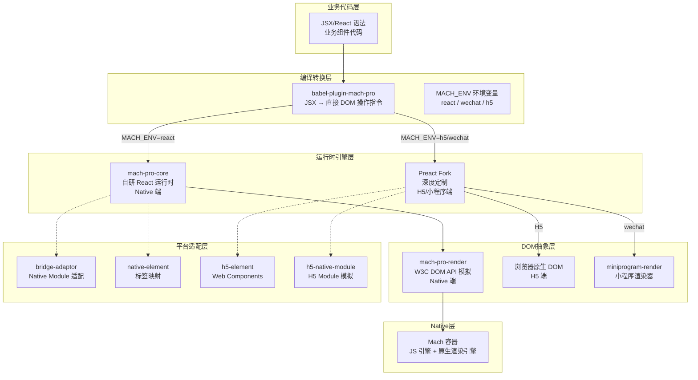
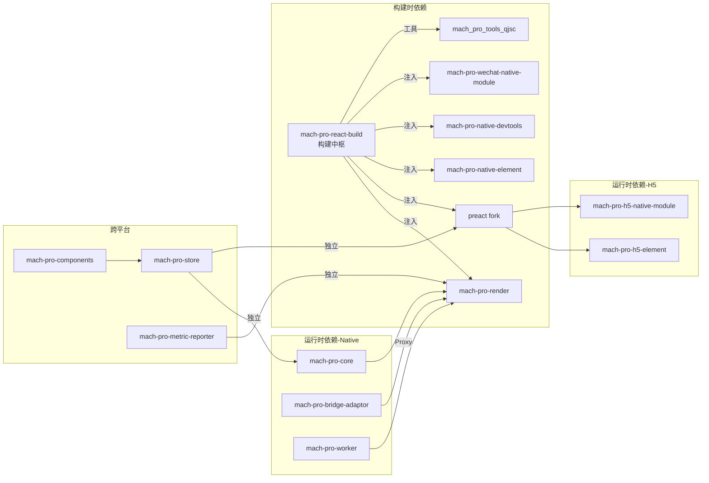

# 第一章：全局架构与设计哲学

> 一句话概括：MachPro 通过"编译时 JSX 转 DOM 指令 + Native 端 DOM API 模拟 + 双引擎三端适配"实现了一套写 React 跑 Native 的全页面动态化方案。

## 1.1 架构全景图

## 1.2 双引擎架构

MachPro 最独特的架构决策是**同时维护两套渲染引擎**，通过编译时环境变量 `MACH_ENV` 切换：

| MACH_ENV | 渲染引擎 | 目标平台 | 构建工具 |
|----------|---------|---------|---------|
| `react` | mach-pro-core（自研） | Native (iOS/Android/HarmonyOS) | Rollup + IIFE |
| `wechat` | Preact fork（定制） | 微信小程序 | Rollup + createApp 包裹 |
| `h5` | Preact fork（定制） | H5 / Web | Vite |

**为什么需要两套引擎？**

Native 端追求**极致性能**，自研的 mach-pro-core 采用编译时优化策略（类 SolidJS），将 JSX 在编译阶段转为直接 DOM 操作，跳过运行时 VDOM diff。而 H5/小程序端需要**更好的 React 生态兼容性**（第三方组件库、React DevTools 等），使用定制 Preact 更合适。两套引擎通过编译时环境变量选择，对业务代码完全透明。

## 1.3 核心模块依赖拓扑

## 1.4 与同类方案的定位对比

MachPro 选择了一条独特的技术路线：**模拟 DOM API + 编译时优化**。

| 维度 | MachPro | React Native | Weex | Flutter |
|------|---------|-------------|------|---------|
| 渲染架构 | JS 操作模拟 DOM → Native 渲染 | JS → Bridge → Native 组件 | JS → Bridge → Native 组件 | Dart → Skia 自绘 |
| 开发语言 | React/JSX | React/JSX | Vue/Rax | Dart |
| DOM 模型 | 模拟 W3C DOM API | 无 DOM 概念 | 无 DOM 概念 | 无 DOM 概念 |
| 编译策略 | 编译时 JSX→DOM 指令 | 运行时 VDOM diff | 运行时 VDOM diff | AOT 编译 |
| 跨端方式 | 一套代码三端编译 | iOS/Android 各自适配 | 双端统一 | 双端统一 |
| 性能特征 | 接近 Native（跳过 VDOM diff） | Bridge 通信开销 | Bridge 通信开销 | 接近 Native（自绘） |
| 生态兼容 | 部分兼容 React 生态 | 完全兼容 React 生态 | Vue 生态 | Dart 生态 |

MachPro 的核心优势在于：**开发者写标准 React 代码，编译器在编译阶段将 JSX 转为直接 DOM 操作指令，运行时跳过 VDOM diff，性能接近 Native**。同时通过 DOM API 模拟层，让 React 代码可以无缝运行在客户端 JS 引擎上。

## 本章小结

MachPro 的设计哲学是"编译时做尽可能多的工作，运行时做尽可能少的事"。通过双引擎架构兼顾 Native 性能和 H5/小程序的生态兼容性，通过 DOM API 模拟层在客户端 JS 引擎中构建了类浏览器的运行环境，使得 React 代码可以直接操作 Native 渲染引擎。整体架构分为六层，从业务代码到 Native 渲染的链路清晰，各层职责明确。

---

## 面试素材

### 高频面试题

**基础题**：请介绍一下 MachPro 的整体架构设计，它与 React Native 有什么本质区别？

**深度题**：为什么 MachPro 需要同时维护两套渲染引擎？这种设计的利弊是什么？

### 参考回答

> MachPro 的核心架构是"编译时优化 + DOM API 模拟 + 双引擎"三位一体。与 React Native 最大的区别在于渲染路径：RN 是 JS 操作虚拟组件 → Bridge 通信 → Native 组件渲染；MachPro 是 JS 操作模拟 DOM → DOM 操作直接映射到 Native 渲染引擎，中间没有 Bridge 序列化/反序列化的开销。编译时优化进一步跳过了运行时 VDOM diff，性能更接近原生。

### 亮点话术

> "在 MachPro 的架构设计中，我们选择了'模拟 DOM API'而非'Bridge 通信'的路线。核心思路是在客户端 JS 引擎中构建一个精简的 W3C DOM 运行环境，让 React 代码直接操作这层 DOM，DOM 操作通过 Element 类的 super 调用直接传递到 Native 渲染引擎。这样省去了 RN 方案中 Bridge 的序列化开销，同时编译时还将 JSX 转为直接 DOM 操作指令跳过 VDOM diff，实现了双重性能优化。"
