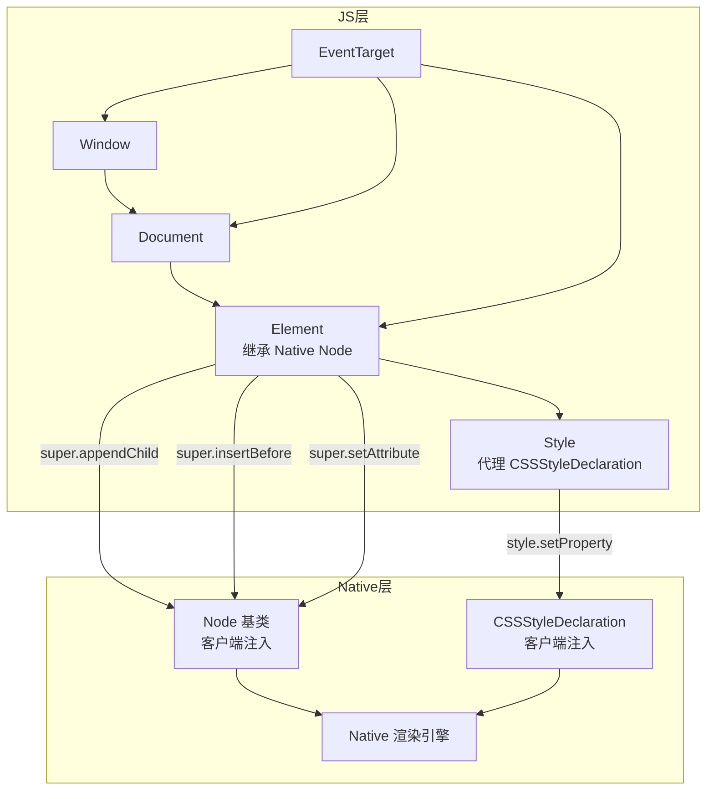

# 第四章：mach-pro-render —— Native DOM 模拟层

> 一句话概括：在客户端 JS 引擎中构建了一个精简的 W3C DOM 运行环境，Element 类通过 `super.xxx()` 调用将 JS 层的 DOM 操作直接传递到 Native 渲染引擎，实现"双树镜像"架构。

## 4.1 核心架构

mach-pro-render 共 18 个源文件，本质是一个 **DOM API 模拟层 + Native 桥接增强层**：



## 4.2 Window 模拟

**文件**：`src/window.ts`（175 行）

```typescript
class Location {
    constructor(href) {
        // 支持三种 URL 格式：
        // 1. http/https → 标准 Web URL 解析
        // 2. /path      → 小程序路径
        // 3. imeituan:// → Native scheme
    }
}

class Window extends EventTarget {
    constructor() {
        // 从 Mach.env 读取屏幕参数
        this.outerWidth = Mach.env.screenWidth;
        this.outerHeight = Mach.env.screenHeight;
        this.devicePixelRatio = Mach.env.scale;
        
        // 路由模块
        this.WMRouter = Mach.requireModule('WMRouter');
    }
    
    open(url)  { this.WMRouter.navigateTo(url) }
    close()    { this.WMRouter.navigateBack() }
    setTimeout = safeSetTimeout;   // 包装默认 delay=0
}

// 全局挂载：window === globalThis
const window = new Window();
getClassKeys(window).forEach(k => globalThis[k] = window[k]);
globalThis.window = globalThis;
```

## 4.3 Element 类 —— JS 与 Native 的桥梁

**文件**：`src/node/element.ts`（275 行）—— **重中之重**

### 双树镜像同步

Element 继承客户端注入的 `Node` 基类。JS 层维护 `childNodes` 数组用于 DOM 查询，Native 层维护渲染树用于实际渲染。两棵树通过 `super.xxx()` 保持一致：

```typescript
class Element extends Node {
    childNodes = [];
    attributes = {};
    listeners = {};
    
    appendChild(node) {
        this.validateTextNode(node);
        node.unlinkParent();
        this.superAppendChild(node);          // → Native 渲染树
        node.parentNode = this;
        this.childNodes.push(node);           // → JS 层 DOM 树
        this.computedTextContent();
    }
    
    superAppendChild(node) {
        if (node.tagName === 'textNode') return;  // 文本节点不进 Native 树
        super.appendChild(node);                   // 调用 Native Node 的方法
    }
}
```

### 💡 关键设计：文本节点折叠

文本节点不进入 Native 树。所有子文本通过 `computedTextContent()` 聚合为父 `<text>` 元素的 `content` 属性：

```typescript
computedTextContent() {
    if (this.tagName !== 'text') return;
    const content = this.childNodes
        .map(c => typeof c.data === 'string' ? c.data : '')
        .join('');
    this.setAttribute('content', content);  // 传给 Native
}
```

### 事件系统

```typescript
addEventListener(event, callback) {
    this.listeners[event] = callback;           // 每事件只保留最后一个
    super.addEventListener(event);              // 只传事件名，不传回调
}

dispatchEvent(event, data) {
    const e = new Event(event);
    e.target = this;
    e.detail = data;
    super.dispatchEvent(e);                     // 通知 Native
    
    // 白名单机制：LIST 中的标签传 Event 对象，其他直接传 data
    if (LIST.includes(this.tagName)) {
        this.listeners[event]?.(e);
    } else {
        this.listeners[event]?.(data);
    }
}
```

### JS-Native 交互边界完整清单

| JS 层方法 | Native 层调用 | 数据流向 |
|-----------|-------------|---------|
| `appendChild(node)` | `super.appendChild(node)` | JS → Native |
| `insertBefore(node, anchor)` | `super.insertBefore(node, anchor)` | JS → Native |
| `removeChild(node)` | `super.removeChild(node)` | JS → Native |
| `setAttribute(name, value)` | `super.setAttribute(name, value)` | JS → Native |
| `addEventListener(event)` | `super.addEventListener(event)` | JS → Native |
| `dispatchEvent(event, data)` | `super.dispatchEvent(event)` | Native → JS |
| `getBoundingClientRect()` | `this.measureInWindow()` | Native → JS |
| `style.setProperty(name, value)` | `super.style.setProperty(name, value)` | JS → Native |

## 4.4 Style 代理

**文件**：`src/node/style.ts`（41 行）

```typescript
class Style {
    constructor(private style: CSSStyleDeclaration) {}
    
    setProperty(name, value) {
        const strValue = String(value);
        if (this[name] !== strValue) {        // JS 侧缓存比较
            this[name] = strValue;
            this.style.setProperty(name, value);  // 变化时才同步到 Native
        }
    }
}
```

💡 **亮点**：JS 侧维护样式缓存，仅值变化时才跨 JS/Native 边界调用，减少序列化开销。

## 4.5 Mach 全局对象扩展

**文件**：`src/mach.ts`（124 行）

```typescript
// 事件订阅系统：引用计数联动
Mach.on(event, handler) {
    handlers[event] = handlers[event] || [];
    handlers[event].push(handler);
    if (handlers[event].length === 1) {
        Mach.subscribeEvent(event);          // 首次订阅通知 Native
    }
    return () => Mach.off(event, handler);   // 返回取消函数
}

// 异步子包加载 + Promise 缓存
Mach.requireBundleAsync(bundleId) {
    if (cache[bundleId]) return cache[bundleId];
    cache[bundleId] = new Promise((resolve) => {
        Mach.__requireBundleAsync__(bundleId, () => {
            resolve(globalThis.__bundleCallback__());
        });
    });
    return cache[bundleId];
}
```

## 4.6 元素垫片

**文件**：`src/elements-shim/`

通过 Monkey-patch `React.createElement` 实现标签透明替换：

```typescript
// jsx.ts
const oldCreateElement = React.createElement;
React.createElement = function(type, ...args) {
    if (ElementMap.has(type)) type = ElementMap.get(type);
    return oldCreateElement(type, ...args);
}
```

**ScrollView 的双端适配**（`ScrollView.tsx`）：

```typescript
if (process.env.MACH_ENV === 'h5') {
    return <scroll-view>{children}</scroll-view>
} else {
    // Native：scroller + content 嵌套结构
    return (
        <scroller ref={ref} style={scrollerStyle}>
            <content style={{ flexDirection: scrollX ? 'row' : 'column' }}>
                {children}
            </content>
        </scroller>
    )
}
```

## 本章小结

mach-pro-render 通过"双树镜像"架构在客户端 JS 引擎中构建了类浏览器运行环境。Element 类继承 Native Node 基类，JS 层维护 DOM 查询树，Native 层维护渲染树，两者通过 super 调用同步。关键优化包括文本节点折叠、Style 缓存脏检查、单 handler 事件模型、标签垫片透明替换。Mach 全局对象扩展了事件订阅（引用计数联动）、JS 模块系统和异步子包加载能力。

---

## 面试素材

### 高频面试题

**基础题**：MachPro 是如何在 Native 环境中支持 DOM 操作的？

**深度题**：Element 类的 `super.appendChild` 背后发生了什么？JS 层和 Native 层的 DOM 树是如何保持同步的？

### 亮点话术

> "在 mach-pro-render 的设计中，我们采用了'双树镜像'架构。Element 类继承客户端注入的 Node 基类，JS 层维护一棵 childNodes 数组形式的 DOM 树用于查询，Native 层维护真正的渲染树。当业务代码调用 `appendChild` 时，我们同时更新 JS 层的 childNodes 数组和通过 `super.appendChild` 更新 Native 渲染树。Style 属性还做了 JS 侧缓存，只有值真正变化时才跨 Bridge 调用 `setProperty`，减少了序列化开销。"
