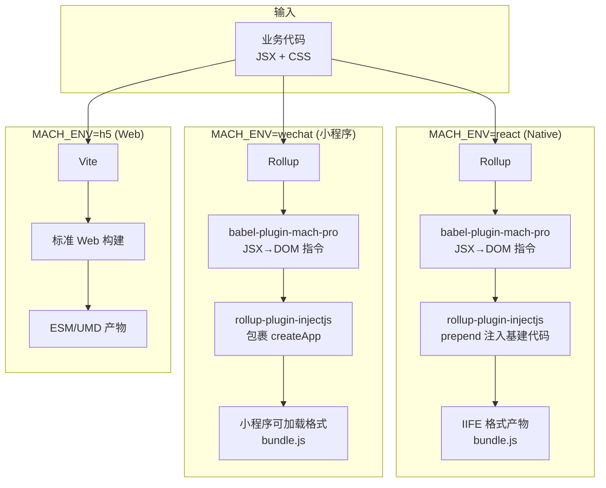

# 第六章：构建系统（mach-pro-react-build）

> 一句话概括：一套构建系统输出三端产物——Rollup 打包 Native/小程序（IIFE 格式 + 多层代码注入），Vite 打包 H5，核心是 rollup-plugin-injectjs 的代码注入机制。

## 6.1 三端构建管线



## 6.2 代码注入机制（rollup-plugin-injectjs）

**文件**：`src/plugins/rollup-plugin-injectjs.ts`（230 行）

这是构建系统的核心插件，通过 `prepend` 模式在业务代码前注入基建代码。

### Native 产物组成

```
┌─ MachBaseCode     ← 公共 Mach 基础 SDK
├─ NativeBaseCode   ← mach-pro-render 的编译产物
├─ PreactCode       ← Preact fork 的 IIFE 包（全局变量 Preact）
├─ NativeElementCode ← native-element 标签映射
└─ 业务代码          ← 编译后的业务 bundle
```

### 小程序产物组成

```
┌─ MPBaseCode       ← 小程序公共基础代码
├─ PreactCode       ← Preact fork 的 IIFE 包
└─ createApp(() => {
       // 业务代码包裹在 createApp 函数中
   })
```

### 注入顺序的重要性

注入顺序**严格不可调整**：

1. `MachBaseCode`：初始化 `Mach` 全局对象、polyfill、环境检测
2. `NativeBaseCode`（mach-pro-render）：模拟 Window/Document/Element，建立 DOM 运行环境
3. `PreactCode`：挂载 `Preact.createElement`/`render` 到全局
4. `NativeElementCode`：monkeypatch `React.createElement` 做标签映射
5. 业务代码：此时 DOM 环境 + React API + 标签映射都已就绪

如果顺序错误（比如业务代码先于 render 执行），`document.createElement` 不存在会直接报错。

### 插件实现关键逻辑

```typescript
export function rollupPluginInjectjs(options) {
    const { env } = options;
    
    return {
        name: 'rollup-plugin-injectjs',
        
        // intro hook: 在模块代码前插入代码
        intro() {
            if (env === 'react') {
                return [
                    readFileSync(MachBaseCodePath, 'utf8'),
                    readFileSync(NativeBaseCodePath, 'utf8'),
                    readFileSync(PreactCodePath, 'utf8'),
                    readFileSync(NativeElementCodePath, 'utf8'),
                ].join('\n');
            }
            if (env === 'wechat') {
                return [
                    readFileSync(MPBaseCodePath, 'utf8'),
                    readFileSync(PreactCodePath, 'utf8'),
                ].join('\n');
            }
        },
        
        // banner/footer: 小程序的 createApp 包裹
        banner: env === 'wechat' ? 'createApp(function(){' : undefined,
        footer: env === 'wechat' ? '})' : undefined,
    }
}
```

## 6.3 Rollup 插件链

**文件**：`src/rollupConfig.ts`（185 行）

完整的 Rollup 插件链包含约 18 个插件，按执行顺序：

| 序号 | 插件 | 功能 |
|------|------|------|
| 1 | alias | 模块路径别名（react→preact/compat 等） |
| 2 | replace | 环境变量替换（MACH_ENV、NODE_ENV） |
| 3 | nodeResolve | node_modules 模块解析 |
| 4 | commonjs | CJS → ESM 转换 |
| 5 | json | JSON 文件 import |
| 6 | babel | JS/TS 编译（含 babel-plugin-mach-pro） |
| 7 | postcss | CSS Module + px 转换 + 样式提取 |
| 8 | image | 图片资源处理（base64 内联） |
| 9 | svg | SVG 处理 |
| 10 | injectjs | 基建代码注入（核心插件） |
| 11 | terser | 代码压缩 |
| 12 | filesize | 产物大小统计 |

### 关键 Babel 配置

```javascript
babel({
    presets: [
        ['@babel/preset-env', { targets: { ios: '10', android: '5' } }],
        '@babel/preset-typescript',
    ],
    plugins: [
        'babel-plugin-mach-pro',           // JSX → DOM 指令（核心）
        '@babel/plugin-transform-react-jsx', // JSX 语法支持
        // ... 其他插件
    ]
})
```

## 6.4 小程序运行时包装

**文件**：`src/temp/base-wechat.ts`（64 行）

小程序产物被包裹在 `createApp(() => { ... })` 中：

```javascript
function createApp(callback) {
    Component({
        attached() {
            // 初始化小程序渲染器
            // 创建 document/window 模拟环境
            callback();  // 执行业务代码
        },
        detached() {
            globalThis.destroyReactApp?.();
        }
    });
}
```

## 6.5 H5 Mach SDK 实现

**文件**：`src/temp/base-h5.ts`（315 行）

H5 端实现了完整的 Mach SDK 模拟，包括：

| 模块 | H5 实现 |
|------|---------|
| `Mach.env` | 从 URL query 和 `navigator.userAgent` 读取 |
| `Mach.requireModule` | 返回各模块的 H5 降级实现 |
| `WMNetwork` | 映射到 `fetch` API |
| `WMRouter` | 映射到 `window.location` / `history` |
| `WMStorage` | 映射到 `localStorage` |
| `WMLogger` | 映射到 `console` |

## 6.6 最终产物结构

```
dist/
├── native/
│   ├── bundle.js      ← 所有代码合并为单文件（IIFE）
│   └── bundle.css     ← 提取的样式
├── wechat/
│   ├── bundle.js      ← createApp 包裹的小程序代码
│   └── bundle.css
├── h5/
│   ├── index.html     ← Vite 生成
│   ├── assets/
│   │   ├── index.xxx.js
│   │   └── index.xxx.css
│   └── ...
└── assets/            ← 图片等静态资源
```

## 本章小结

MachPro 的构建系统通过 MACH_ENV 环境变量驱动三端产物生成。核心是 rollup-plugin-injectjs 的代码注入机制，Native 端将 render 层 + Preact + 标签映射按严格顺序注入到业务代码之前，小程序端用 createApp 包裹，H5 端使用 Vite 标准构建。Rollup 插件链包含 18 个插件覆盖编译、样式、资源、注入、压缩全链路。

---

## 面试素材

### 高频面试题

**基础题**：MachPro 的三端构建差异是什么？为什么 Native 端用 Rollup 而 H5 用 Vite？

**深度题**：代码注入的顺序为什么重要？如果调换顺序会发生什么？

### 亮点话术

> "在构建系统设计上，我们选择了'多工具协同'的方案。Native 端用 Rollup 是因为需要输出严格的 IIFE 单文件，且需要 `intro` hook 做多层代码注入；H5 端用 Vite 是因为开发体验更好（HMR 快、ESM 原生支持）。注入顺序是严格的——render 层必须在 Preact 之前初始化 DOM 环境，native-element 必须在业务代码前完成标签映射。这些 Runtime 基建代码通过 rollup-plugin-injectjs 的 `intro` hook prepend 到产物前面，保证执行时序。"
