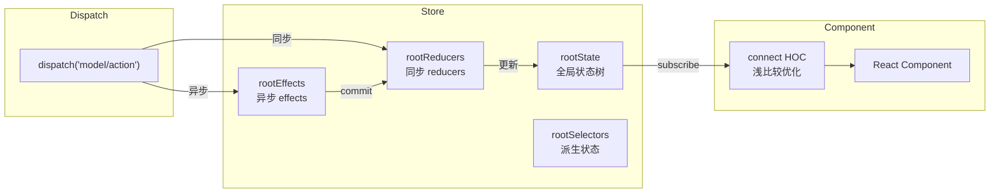

# 第八章：状态管理（mach-pro-store）

> 一句话概括：自研的类 Rematch 状态管理方案，通过 `modelName/reducerName` 路由分发 + 全局单例 + connect HOC 浅比较实现跨组件状态共享。

## 8.1 架构设计



## 8.2 核心实现

### rematch.ts —— Store 核心

**文件**：`src/rematch.ts`

```typescript
class Store {
    rootState = {};       // 全局状态树
    rootReducers = {};    // { modelName: { reducerName: fn } }
    rootEffects = {};     // { modelName: { effectName: fn } }
    rootSelectors = {};   // { modelName: { selectorName: fn } }
    listeners = [];       // 订阅者列表
    
    addModel(model) {
        const { name, state, reducers, effects, selectors } = model;
        this.rootState[name] = state;
        this.rootReducers[name] = reducers;
        this.rootEffects[name] = effects || {};
        this.rootSelectors[name] = selectors || {};
    }
    
    dispatch(actionType, payload) {
        // 路由格式: "modelName/reducerName"
        const [modelName, actionName] = actionType.split('/');
        
        // 优先查找 reducer（同步）
        if (this.rootReducers[modelName]?.[actionName]) {
            const reducer = this.rootReducers[modelName][actionName];
            const newState = reducer(this.rootState[modelName], payload);
            this.rootState[modelName] = { ...this.rootState[modelName], ...newState };
            this.notify();  // 通知所有订阅者
            return;
        }
        
        // 查找 effect（异步）
        if (this.rootEffects[modelName]?.[actionName]) {
            const effect = this.rootEffects[modelName][actionName];
            return effect(payload, {
                state: this.rootState,
                dispatch: this.dispatch.bind(this),
                commit: (reducerName, payload) => {
                    this.dispatch(`${modelName}/${reducerName}`, payload);
                }
            });
        }
    }
    
    subscribe(listener) {
        this.listeners.push(listener);
        return () => {
            this.listeners = this.listeners.filter(l => l !== listener);
        };
    }
    
    notify() {
        this.listeners.forEach(listener => listener());
    }
}
```

### 全局单例

```typescript
// 确保多个 bundle 共享同一个 store 实例
if (!globalThis.__MACH_PRO_STORE__) {
    globalThis.__MACH_PRO_STORE__ = new Store();
}
export default globalThis.__MACH_PRO_STORE__;
```

### Model 定义规范

```typescript
const userModel = {
    name: 'user',
    state: {
        name: '',
        avatar: '',
        isLogin: false,
    },
    reducers: {
        setUser(state, payload) {
            return { name: payload.name, avatar: payload.avatar };
        },
        setLogin(state, payload) {
            return { isLogin: payload };
        },
    },
    effects: {
        async fetchUser(payload, { commit }) {
            const res = await Mach.requireModule('WMNetwork').request(/*...*/);
            commit('setUser', res.data);
        },
    },
    selectors: {
        displayName(state) {
            return state.name || '未登录';
        },
    },
};

store.addModel(userModel);
```

## 8.3 connect HOC

**文件**：`src/connect.ts`

```typescript
function connect(mapStateToProps, mapDispatchToProps) {
    return function(WrappedComponent) {
        return class Connected extends Component {
            unsubscribe = null;
            
            componentDidMount() {
                this.unsubscribe = store.subscribe(() => {
                    const nextProps = mapStateToProps(store.rootState);
                    // 浅比较优化：只有映射的 props 变化才更新
                    if (!shallowEqual(this.mappedProps, nextProps)) {
                        this.mappedProps = nextProps;
                        this.forceUpdate();
                    }
                });
            }
            
            componentWillUnmount() {
                this.unsubscribe?.();
            }
            
            render() {
                const stateProps = mapStateToProps(store.rootState);
                const dispatchProps = mapDispatchToProps?.(store.dispatch) || {};
                return createElement(WrappedComponent, {
                    ...this.props,
                    ...stateProps,
                    ...dispatchProps,
                });
            }
        };
    };
}
```

使用示例：

```typescript
const ConnectedHeader = connect(
    (state) => ({
        userName: state.user.name,
        isLogin: state.user.isLogin,
    }),
    (dispatch) => ({
        fetchUser: () => dispatch('user/fetchUser'),
        logout: () => dispatch('user/setLogin', false),
    })
)(Header);
```

## 8.4 与主流方案对比

| 维度 | MachPro Store | Redux + Redux Toolkit | Rematch | Zustand |
|------|-------------|----------------------|---------|---------|
| Model 定义 | `addModel({ name, state, reducers, effects })` | `createSlice` | `createModel` | `create(set => ({}))` |
| 异步处理 | effects + commit | Thunk/Saga | effects + commit | 直接 set |
| 路由分发 | `"model/action"` 字符串 | action type 常量 | `dispatch.model.action()` | 无 |
| 状态隔离 | rootState[modelName] | combineReducers | rootState[modelName] | 独立 store |
| 组件连接 | connect HOC（浅比较） | useSelector / connect | connect | useSyncExternalStore |
| 全局单例 | globalThis.__MACH_PRO_STORE__ | createStore 单例 | init() | create() |
| 体积 | ~200 行 | ~2KB(RTK) + ~5KB(Redux) | ~1KB | ~1KB |

## 本章小结

mach-pro-store 用约 200 行代码实现了完整的状态管理方案。设计灵感来自 Rematch，采用 Model 范式组织状态、同步 reducers 和异步 effects。dispatch 通过 `"modelName/reducerName"` 路由分发，connect HOC 通过浅比较优化渲染。全局单例模式通过 `globalThis.__MACH_PRO_STORE__` 确保多 bundle 共享。方案轻量实用，完全满足动态化页面的状态管理需求。

---

## 面试素材

### 高频面试题

**基础题**：为什么自研状态管理而不用 Redux/MobX？

**深度题**：`"modelName/reducerName"` 的字符串路由方案有什么优缺点？如何保证类型安全？

### 参考回答

> 自研原因有三点：1) 体积考量——整个 store 只有约 200 行，远小于 Redux 生态全家桶；2) 场景适配——动态化页面通常状态逻辑不复杂，不需要 middleware、DevTools 等高级能力；3) 跨 bundle 共享——通过 `globalThis` 单例模式确保主 bundle 和子 bundle 共享同一个 store 实例，这在 Redux 的标准用法中需要额外配置。

### 亮点话术

> "我们的状态管理方案借鉴了 Rematch 的 Model 范式，用约 200 行代码实现了 state/reducers/effects/selectors 的完整能力。dispatch 采用 `modelName/reducerName` 字符串路由，运行时解析比 Redux 的 action type 常量更简洁。connect HOC 内部做浅比较优化，只有映射的 props 变化才触发 re-render。全局通过 `globalThis.__MACH_PRO_STORE__` 单例模式保证多 bundle 共享，适合动态化场景中主包和子包的状态共享需求。"
